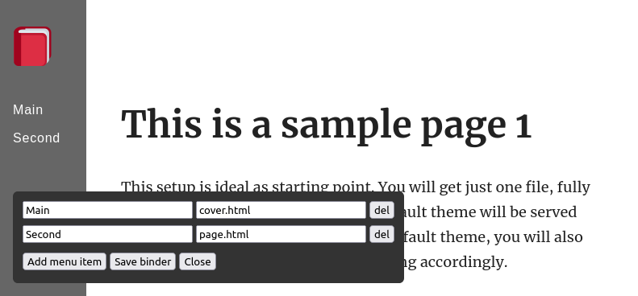

[English](README.md)

# IMP Binder

IMP Binder 📎 это шаблон, позволяющий собрать мини-сайт из нескольких страничек, сделанных
с помощью[ IMP! ](https://github.com/girobusan/imp). В процессе.

## Возможности

- Связывает несколько страничек, сделанных в IMP! в один мини-сайт с редактируемым меню.
- Сайт работает даже с отключенным Java Script.
- Меню можно редактировать прямо в браузере с помощью GUI, когда сайт открыт локально.
- Для этого не нужно запускать локальный сервер, достаточно просто открыть файл в браузере.
- Можно менять под себя практически всё.

## Возможности сайта

### Без Java Script
- Отображение меню
- Страницы открываются по клику

### С Java Script
Все вышеизложенное, плюс:
- Адрес в адресной строке соответствует открытой странице (и им можно делиться)
- Заголовок окна браузера отображает заголовок текущей открытой страницы

## Доработка
Вы можете редактировать основной html файл как вам удобно, с некоторыми ограничениями:

- Не используйте теги `style`, они удаляются при сохранении.
- Структура HTML меню должна быть: nav -> ul -> li -> a
- Не меняйте ничего в теге `script` (но если знаете, как его улучшить - меняйте).

